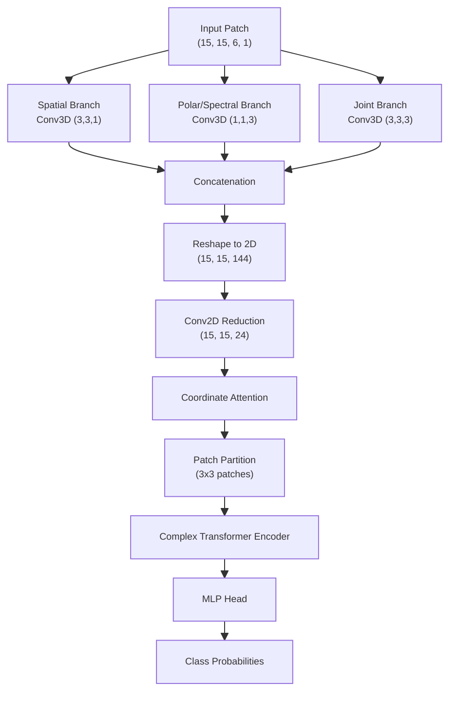

# CV-MsAtViT: モデルアーキテクチャ詳細解説

このドキュメントでは、`CV-MsAtViT` (Complex-Valued Multi-scale Attention ViT) のアーキテクチャについて、コードと論文の文脈に基づき数式レベルで解説します。特に初学者が躓きやすいポイントを「Q&A」形式で詳述します。

## 1. 処理フロー概要

モデル全体のデータの流れは以下の通りです。

1.  **Input**: PolSARデータ ($15 \times 15$ パッチ, 6チャンネル, 複素数)
2.  **3D Multi-Scale Feature Extraction**: 3つの異なる視点（空間、偏波、同時）で特徴抽出
3.  **Reshape & 2D Conv**: 3D特徴量を2D平面上の特徴量へ圧縮・変換
4.  **Coordinate Attention**: 重要な空間位置・特徴を強調
5.  **Complex ViT (Vision Transformer)**: パッチ分割して大域的な関係性を学習
6.  **MLP Head**: クラス分類

---

## 2. 各ステップの数式定義

入力データを $X \in \mathbb{C}^{H \times W \times D}$ とします。ここで $H=W=15$ (Window Size), $D=6$ (PolSAR Features) です。

### 2.1 Multi-Scale Feature Extractor (3 Branches)
入力は4次元テンソル $\mathcal{X} \in \mathbb{C}^{H \times W \times D \times 1}$ として扱われます（最後の1はInput Channel）。

**Conv3Dの計算式詳細**:
Conv3Dは、3次元のカーネル $K$ を入力 $\mathcal{X}$ 内で（縦、横、深さ）の全方向にスライドさせながら計算を行います。
位置 $(h, w, d)$ における $f$ 番目のフィルタの出力値 $y_{h,w,d}^{(f)}$ は以下の畳み込み演算で求められます。

$$y_{h,w,d}^{(f)} = \sum_{i=1}^{K_H} \sum_{j=1}^{K_W} \sum_{k=1}^{K_D} \mathcal{X}_{(h+i), (w+j), (d+k)} \cdot K_{i,j,k}^{(f)} + b^{(f)}$$

ここで $K_H, K_W, K_D$ はカーネルのサイズ（例: 3, 3, 3）です。
重要なのは、**「カーネルが深さ方向 ($D$) にも動く」** という点です。
*   これまでの通常のConv2Dは、深さ（チャンネル）は「全て一度に足し合わせる」ものでしたが、Conv3Dでは深さ方向にも**局所的な相関**を見ます。
*   `padding="same"` (ゼロパディング)のため、出力のサイズ $(H, W, D)$ は入力と維持されます。

**実部・虚部の扱いについて**:
上記の式における掛け算 ($\cdot$) は、**複素数の乗算** として定義されます。
入力 $\mathcal{X} = A + jB$、カーネル $K = C + jD$ とすると、それぞれの積は以下のように計算されます（分配法則）。
$$
\begin{aligned}
\mathcal{X} \cdot K &= (A + jB)(C + jD) \\
&= (AC - BD) + j(AD + BC)
\end{aligned}
$$
つまり、内部的には4回の実数乗算と加減算が行われており、**「位相情報（実部と虚部のバランス）」を保ったまま**畳み込みが行われます。これにより、SARデータの位相差情報が損なわれることなく次層へ伝播します。

各ブランチの役割は以下の通りです。
**注: 各ブランチは「Conv3D → ReLU → Conv3D → ReLU」の2層構造**になっています。以下では簡略化のため $f(\mathcal{X})$ のように記述していましたが、正確には以下のような処理が行われます。
$$Y = \sigma(\text{Conv3D}(\sigma(\text{Conv3D}(\mathcal{X}))))$$

1.  **Spatial Branch ($Y_S$)**: 空間的なテクスチャ情報を抽出。
    $$Y_S = \sigma(\text{Conv3D}_{3 \times 3 \times 1}(\sigma(\text{Conv3D}_{3 \times 3 \times 1}(\mathcal{X}))))$$
    ここで $\sigma$ は **`cart_relu` (Cartesian ReLU)** 活性化関数です。実部と虚部それぞれに ReLU を適用します ($\text{ReLU}(x) + j\text{ReLU}(y)$)。
    カーネルサイズ $(3, 3, 1)$ は、偏波（深さ）方向には混ぜず、空間方向 ($H, W$) のみ畳み込みます。
    **出力サイズ**: $(15, 15, 6, 8)$

2.  **Polar/Spectral Branch ($Y_P$)**: 偏波間の相関（散乱メカニズム）を抽出。
    $$Y_P = \sigma(\text{Conv3D}_{1 \times 1 \times 3}(\sigma(\text{Conv3D}_{1 \times 1 \times 3}(\mathcal{X}))))$$
    カーネルサイズ $(1, 1, 3)$ は、空間的には1画素のみを見つつ、深さ方向（偏波チャンネル）の局所的な関係性を学習します。
    **出力サイズ**: $(15, 15, 6, 8)$

3.  **Joint Branch ($Y_J$)**: 空間と偏波を同時に考慮。
    $$Y_J = \sigma(\text{Conv3D}_{3 \times 3 \times 3}(\sigma(\text{Conv3D}_{3 \times 3 \times 3}(\mathcal{X}))))$$
    **出力サイズ**: $(15, 15, 6, 8)$

これらを結合します：
$$Y_{concat} = \text{Concat}(Y_S, Y_P, Y_J)$$
**出力サイズ**: $(15, 15, 6, 24)$ ($8+8+8=24$)

### 2.2 Reshape & 2D Projection
3Dの情報を2Dの特徴マップに投影します。深さ方向 $D$ と 特徴数 $C$ をフラットにします。
$$Z_{2D} = \text{Reshape}(Y_{concat}) \in \mathbb{C}^{H \times W \times (D \cdot 3F_{out})}$$
**フラット化の順序**: 
`Reshape` は直前の次元から順に並べます。つまり、以下の順序で並びます。
`[Depth 1 の全24特徴量, Depth 2 の全24特徴量, ..., Depth 6 の全24特徴量]`
これにより、深さごとの情報は保たれつつ、チャンネル次元として一列に展開されます。

その後、Conv2Dでチャンネル数を **144 → 24** に圧縮・統合します。
$$Z = \sigma(\text{Conv2D}(Z_{2D})) \in \mathbb{C}^{H \times W \times 24}$$
**仕組み**:
前のステップ（Reshape）により、チャンネル数は $6(\text{Depth}) \times 24(\text{Filters}) = 144$ になっています。
これに対して `filters=24` の Conv2D ($3 \times 3$ カーネル) を適用します。
**使用されている活性化関数**: コード(`model_factory.py`)では明示的に **`cart_relu`** が指定されています。
$$Z = \text{cart\_relu}(\text{Conv2D}(Z_{2D})) \in \mathbb{C}^{H \times W \times 24}$$
**注**: このConv2D層は **1層のみ** 適用されます。3D CNN部と異なり、繰り返されません。

**Conv2Dの計算式**:
入力チャンネル数を $C_{in}=144$、フィルター数 $F=24$ とします。
位置 $(h, w)$ における $k$ 番目のフィルターの出力 $z_{h,w}^{(k)}$ は、全入力チャンネルの総和となります。

$$z_{h,w}^{(k)} = \sum_{c=1}^{C_{in}} \sum_{i=1}^{K_H} \sum_{j=1}^{K_W} Z_{2D}^{(c)} (h+i, w+j) \cdot W_{i,j}^{(k, c)} + b^{(k)}$$

*   ここでの重要な点は、**「チャンネル方向 ($c$) について和をとる ($\sum_{c=1}^{C_{in}}$)」** ことです。
*   Conv3Dでは深さ方向をスライドしていましたが、Conv2Dでは**全チャンネルの情報を一点に圧縮（ブレンド）**します。
*   これにより、ばらばらだった144個の特徴マップが、互いに関連付けられて24個に統合されます。
*   もちろん、ここでの積 $\cdot$ も**複素数演算** $(A+jB)(C+jD)$ です。

### 2.3 Coordinate Attention (CoordAtt)
Reshape・Conv2Dの後に適用される、重要な特徴強調モジュールです。
通常のGlobal Average Pooling（空間全体の平均）とは異なり、**「縦方向の平均」と「横方向の平均」を別々に計算**するのが特徴です。

**入力・出力サイズ**:
*   **Input**: $(15, 15, 24)$ （この24はチャンネル数）
*   **Output**: $(15, 15, 24)$ （入力と同じサイズ）

**処理詳細**:
以下のステップで複素数のAttentionマップを生成・適用します。

1.  **Coordinate Pooling (複素平均)**:
    入力特徴量マップ $X$（複素数）に対して、実部と虚部をそれぞれ独立に平均化します。
    *   **X Pooling**: $(15, 15, 24) \to (15, 1, 24)$
        高さ15画素ごとの「横方向平均」をとります（縦に潰す）。
        $$z_h = \text{AvgPool}_w(Re(X)) + j \cdot \text{AvgPool}_w(Im(X))$$
    *   **Y Pooling**: $(15, 15, 24) \to (1, 15, 24)$
        幅15画素ごとの「縦方向平均」をとります（横に潰す）。

2.  **Interaction & Sigmoid (情報交換)**:
    縦と横の特徴ベクトルを結合して、チャンネル間の相関関係（Interaction）を学習させます。
    
    1.  **Concatenate**: 縦ベクトル $(15, 1, 24)$ と横ベクトル $(1, 15, 24)$（を転置したもの）を結合し、長いベクトル $(1, 15+15, 24)$ を作ります。
    2.  **Conv2D & Activation (Bottleneck)**:
        これを $1 \times 1$ Conv2D に通し、チャンネル数を減らします。
        *   **Reduction Ratio**: コード(`model_factory.py`)では `reduction=4` が指定されています。
        *   **計算**: `max(8, 24 // 4)` なので、中間チャンネル数は **8** になります（$24 \to 8$）。
        *   **計算**: `max(8, 24 // 4)` なので、中間チャンネル数は **8** になります（$24 \to 8$）。
        *   その後、`ComplexBatchNormalization` と **`cart_relu` を使用した独自の活性化関数 (`coord_act`)** を適用します。
            *   **重要: Batch Normの処理**: ここで用いられる `ComplexBatchNormalization` は、実部と虚部の **共分散行列** を計算し、**白色化 (Whitening)** を行うことで相関を取り除きながら正規化する、数学的に高度で適切な処理です。
            *   **Coordinate Activation**: 一方で、その後の `coord_act` は以下の非対称な計算を行います。
            *   具体的な中身: $x \times \frac{\text{cart\_relu}(x+3, \text{max}=6)}{6}$
            *   これは "Hard Swish" の複素数版（実部・虚部独立適用）に相当します。
        *   **目的**: 一度情報を圧縮することで、重要な相関関係だけを抽出すると同時に、計算量を削減します（Squeeze-and-Excitationと同様のボトルネック構造）。
    3.  **Split**:
        中間特徴量 $(1, 30, 8)$ を再び「縦用 $(15, 1, 8)$」と「横用 $(1, 15, 8)$」に分割します。
    4.  **Expansion & Sigmoid (チャンネル復元)**:
        それぞれのベクトルを $1 \times 1$ Conv2D で元のチャンネル数 $24$ に戻し（$8 \to 24$）、最後に **`cart_sigmoid`** 関数を適用します。
        *   **Expansionの仕組み**: CNNでチャンネルを増やすのは簡単です。入力が8チャンネルでも、**24個のフィルター**を用意すれば、出力は24チャンネルになります。
        *   各フィルターが「8つの入力全ての線形結合」を計算して新しい1つのチャンネルを作るため、失われた情報を推論・補完しながら次元を復元します。
        
    $$A_h \in \mathbb{C}^{15 \times 1 \times 24}, \quad A_w \in \mathbb{C}^{1 \times 15 \times 24}$$
    これらは **複素数 (Complex-valued)** の重み係数であり、`cart_sigmoid` によって実部・虚部がそれぞれ $(0, 1)$ に収められます。

3.  **Reweighting (複素数再重み付け)**:
    生成された重み $A_h, A_w$ を元の入力に掛け算します。
    $$Y = X \times A_h \times A_w$$
    ここでは **複素数の掛け算** が行われるため、振幅（信号強度）の調整だけでなく、**位相（回転）も調整されます**。

これにより、モデルは「画像の**どこに**重要な特徴（例：境界線や特定の物体）があるか」という位置情報を正確に捉えることができます。

### 2.4 Complex Vision Transformer

**入力・出力サイズ**:
*   **Input**: $(15, 15, 24)$
*   **Patch Partition**: $5 \times 5 = 25$ 個のパッチに分割。各パッチの次元は $3 \times 3 \times 24 = 216$。
*   **Linear Projection(線形射影)**: 各パッチを `projection_dim=32` 次元に圧縮(線形変換のみ)。
    *   **処理詳細**: 分割されたパッチ（フラット化済み: $3 \times 3 \times 24 = 216$ 次元）に対し、**全結合層 (`ComplexDense`)** を通して32次元に変換します。
    *   $$z = x_{patch} \cdot W + b \quad \text{where } W \in \mathbb{C}^{216 \times 32}$$
    *   **複素演算**: ここでは `ComplexDense` を使用しているため、複素行列積が行われます。
        $(A+jB)(C+jD) = (AC-BD) + j(AD+BC)$
        つまり、**実部と虚部は互いに混ざり合い（クロスし）ながら**射影されます。
    *   Transformerへの入力テンソル形状: `(Batch, 25, 32)`
*   **Output**: 同じく `(Batch, 25, 32)` （入力サイズと変わらず、特徴量だけが変換される）

画像をパッチ $x_p \in \mathbb{C}^{N \times (P^2 \cdot C)}$ に分割し、位置埋め込み $E_{pos}$ を加えます。
$$z_0 = [x_p^1 E; x_p^2 E; \dots; x_p^N E] + E_{pos}$$

### 2.5 Transformer Blockの詳細 (Inside the Loop)
Transformerブロックは以下の手順で処理されます。

**Step 1: Attention Block**
1.  **分離 & 正規化 (Pre-Norm)**:
    入力 $z$ を実部・虚部に分け、それぞれ独立に正規化します。
    *   $z_{r}' = \text{LayerNorm}(Re(z)), \quad z_{i}' = \text{LayerNorm}(Im(z))$
2.  **Self-Attention (Parallel)**:
    実部・虚部それぞれで独立して Self-Attention を行います。
    ※各内部で `Input -> Q/K/V -> Softmax -> Context -> OutputDense` の処理が完結しています。
    *   $O_{r} = \text{MultiHeadAttention}(z_{r}', z_{r}')$
    *   $O_{i} = \text{MultiHeadAttention}(z_{i}', z_{i}')$
3.  **結合 (Recombine)**:
    $O = O_{r} + j O_{i}$
4.  **スキップ接続 (Residual)**:
    元の入力（正規化前）を足します。
    $z_{mid} = O + z$

**Step 2: MLP Block**
5.  **分離 & 正規化 (Pre-Norm)**:
    $z_{mid}$ を再び分離・正規化します。
    *   $z_{mr}' = \text{LayerNorm}(Re(z_{mid})), \quad z_{mi}' = \text{LayerNorm}(Im(z_{mid}))$
    *   $z_{m}' = z_{mr}' + j z_{mi}'$
6.  **MLP (Interaction)**:
    ここで初めて複素数として扱われ、実部と虚部が混ざり合います。
    *   $M = \text{ComplexMLP}(z_{m}')$
7.  **スキップ接続 (Residual)**:
    $z_{out} = M + z_{mid}$
MHSAの後に適用される、各パッチの **内部特徴変換** ポートです。特徴量の「意味」を深く学習します。

1.  **構造**: 2層の `ComplexDense` 層から成ります。
    *   通常、中間層で次元を拡大（Expansion）してから元に戻します。
    *   コード設定では `transformer_units = [64, 32]` （`projection_dim`の2倍に拡大して戻す）となっています。
    *   $$32 \to 64 \to 32$$
    *   **計算式(複素積)**:
        1.  **Expansion**: $z_{mid} = \text{cart_GELU}(z_{in} \cdot W_1 + b_1)$
            ここで $W_1 \in \mathbb{C}^{32 \times 64}$。入力32次元を64次元に広げます。
        2.  **Projection**: $z_{out} = \text{cart_GELU}(z_{mid} \cdot W_2 + b_2)$
            ここで $W_2 \in \mathbb{C}^{64 \times 32}$。64次元から元の32次元に戻します。
        ※ここでの掛け算 $\cdot$ は全て複素行列積です。

2.  **複素Interaction（ここが重要）**:
    *   Attention層では実部と虚部が独立していましたが、MLP層（`ComplexDense`）では**実部と虚部が完全にクロスして計算されます**。
    *   活性化関数には **`cart_gelu`** が使用され、複素平面上での非線形変換が行われます。
    *   ここで初めて、Attentionが集めてきた「実部（振幅強度の情報）」と「虚部（位相の変化の情報）」が統合・解釈される。

### 2.6 Transformer Blockの全体像（繰り返し処理）
上記の "MHSA" と "MLP" を一つのセットとして、**Transformer Block** と呼びます。
コード(`model_factory.py`)のデフォルト設定では、このブロックを **4回繰り返し（Loop）** ます (`transformer_layers=4`)。

**1ブロック内の正確な処理フロー (Pre-Norm設計)**:
入力 $z_{in}$ に対して、以下の順序で計算が行われます。

1.  **前半 (Attention Block)**:
    *   **LayerNorm**: 実部・虚部独立に正規化 ($z_{norm1}$)
        $$LN(z) = \frac{Re(z) - \mu_r}{\sigma_r}\gamma_r + \beta_r + j \left( \frac{Im(z) - \mu_i}{\sigma_i}\gamma_i + \beta_i \right)$$
        *   $\mu_r, \mu_i$: 実部・虚部それぞれの平均
        *   $\sigma_r, \sigma_i$: 実部・虚部それぞれの標準偏差
        *   $\gamma_r, \gamma_i$: スケールパラメータ（学習可能な重み）
        *   $\beta_r, \beta_i$: シフトパラメータ（学習可能なバイアス）
    *   **MHSA**: $z_{attn} = \text{MHSA}(z_{norm1})$
    *   **Residual**: $z_{mid} = z_{in} + z_{attn}$ （単純加算）

2.  **後半 (MLP Block)**:
    *   **LayerNorm**: 再び正規化 ($z_{norm2} = LN(z_{mid})$)
    *   **MLP**: $z_{mlp} = \text{MLP}(z_{norm2})$
    *   **Residual**: $z_{out} = z_{mid} + z_{mlp}$

$$z_{out} = \text{Block}(z_{in})$$
この $z_{out}$ が、次のブロックの入力 $z_{in}$ となり、計4回繰り返されます。
これにより、層を深くしても勾配が消滅せず、徐々に（段階的に）高度な特徴を学習できます。

## Q. Transformer詳細解説

**Q: パッチサイズはどうなっていますか？**
**A:** `patch_size=3` が指定されています。
Coordinate Attentionを経た $15 \times 15$ の特徴マップを、**$3 \times 3$ の小さなパッチ** に切り分けます。
つまり、縦横 $15/3 = 5$ なので、合計 $5 \times 5 = 25$ 個のパッチ（トークン）が生成されます。

**Q: 位置埋め込みとは何ですか？ ワンホットベクトルですか？
A: いいえ、ワンホットベクトルではなく、**学習可能な密ベクトル（実数の詰まった配列）**です。
これは TensorFlow/Kerasの標準機能 (`tf.keras.layers.Embedding`) として備わっています。

パッチに「0, 1, 2, ..., 24」という整数の番号（ID）を振ります。
`layers.Embedding` 層にこのIDを渡すと、内部で管理している「辞書（重み行列）」から、対応するベクトルを自動で取り出してくれます。
この「辞書の中身」自体も、学習プロセス（逆伝播）の中で自動的に最適な値に更新されていきます。つまり、プログラマは「IDを渡す」だけで、あとはライブラリが良きように学習・変換してくれます。

**Q: 位置埋め込みはなんのためにあるのですか？**
A: **画像の「どこにあったパッチか」を覚えさせておくため**です。
Transformer（Self-Attention）は、データの順番を気にしない（＝どこにあっても同じ計算をする）性質があります。「左上の角」も「右下の角」も、ただのベクトルの集まりとして平等に扱ってしまいます。
これでは「空が上にあって地面が下にある」といった空間構造を理解できないため、「これは1番目のパッチ（左上）だよ」「これは25番目だよ」という目印（位置ベクトル）を足し合わせることで、場所の情報を教えてあげる必要があります。

**Q: 一般的なViTでも使われていますか？**
A: **はい、必須です。**
Googleのオリジナル論文 "An Image is Worth 16x16 Words" でも、同様の **Learnable 1D Position Embedding** が採用されています。2D（X, Y座標）を使わずに、単に 1, 2, ... N という通し番号を使う方法が標準的で、これで十分な精度が出ることが分かっています。このコードもその標準に完全に従っています。

**Q: MHSAの実部・虚部結合は、単純に足しているだけですか？**
**A:** はい、その通りです。
「実部だけの世界」と「虚部だけの世界」でそれぞれAttention（どのパッチに注目すべきか）を計算し、最後に実部を実部、虚部を虚部として `tf.complex(real, imag)` で合体させています。

**Q: そもそもMHSA (Multi-Head Self-Attention) とは何ですか？**
**A:** 「自分自身のどの部分に注目すべきか」を計算する機構です。
1.  **分身の術（Multi-Head）**:
    例えば32次元の特徴量ベクトルを、8次元 $\times$ 4つのヘッド（分身）に分割します。
    それぞれのヘッドは**独立した重み**を持っており、互いに相談することなく勝手に学習を進めます。

2.  **役割分担の発生**:
    最初は全員ランダムですが、学習が進むにつれ、全員が同じこと（例: 形を見る）をしていてもLossが下がらないため、自然と**「僕はエッジを見る」「私は色の濃さを見る」**といった役割分担が発生します（これを「豊かな特徴を捉える」と表現します）。
    ※人間が「お前はテクスチャを見ろ」と命令するわけではなく、結果的にそうなります。

3.  **Attention計算**:
    各ヘッドが独自に **Query(質問)** と **Key(索引)** の内積をとり、どこに注目するかを決め、**Value(内容)** を集めます。
    最後に全員の成果を持ち寄って結合 (Concatenate) し、元の32次元に戻します。

**Q: Q, K, V はどのように決まるのですか？**
**A:** 入力であるパッチの特徴量ベクトル ($z$) に対して、**3つの異なる重み行列 (Dense層)** を掛け算して作られます。
コード上では `layers.MultiHeadAttention()(x, x)` という形で呼び出されていますが、この内部で以下のような計算が行われています。
*   $Q = z \times W_Q$ （$W_Q$: 学習される重み）
*   $K = z \times W_K$ （$W_K$: 学習される重み）
*   $V = z \times W_V$ （$W_V$: 学習される重み）
つまり、**「元のデータ $z$ を、Q用、K用、V用の空間へそれぞれ変換（射影）する」** ことで生成されます。
これらは全てニューラルネットワークのパラメータであり、学習によって「良いQ, K, Vの作り方」が最適化されていきます。

これにより、層を深くしても勾配が消滅せず、徐々に（段階的に）高度な特徴を学習できます。

### 2.7 Classification Head (分類ヘッド)
Transformerブロックから出力された特徴量を使って、最終的なクラス分類を行うパートです。
ここまでは全て **複素数 ($z$)** として計算が続いてきましたが、最後に **実数 ($P$)** の確率に変換されます。

1.  **Complex Flatten (平坦化)**:
    *   入力: `(Batch, 25, 32)` の複素数テンソル。
    *   処理: パッチの次元と特徴量の次元を一列に展開します。
    *   出力: `(Batch, 800)` の複素数ベクトル ($25 \times 32 = 800$)。

2.  **MLP Head (分類用特徴圧縮)**:
    *   フラットになったベクトルを、さらに `ComplexDense` 層で抽象化・圧縮します。
    *   $$800 \to 1024 \to 512$$
    *   ここでもまだ **複素数** のまま、活性化関数 (`cart_gelu` または `cart_relu`) で非線形変換されます。

3.  **Final Dense (Logits生成)**:
    *   `ComplexDense(num_classes)`: クラス数（例: 15）と同じ数の **ニューロン** が用意されています。
    *   **処理**: 各ニューロンが「自分が担当するクラス（例：森林）」らしさを計算します。入力512次元の情報に対し、複素数の重みを掛けて合計します。
    *   **出力**: $z_{logits} \in \mathbb{C}^{15}$。これが各クラスのスコア（Logits）です。
        *   例: $z_{Forest} = 3.5 + 2.1j$ （振幅が大きい＝森林っぽい！）
        *   例: $z_{Water} = 0.1 + 0.2j$ （振幅が小さい＝水っぽくない）
    *   この時点ではまだ **複素数** であり、位相情報も含まれています。

4.  **Softmax Real with Abs (確率への変換)**:
    *   最後の活性化関数で、複素数を実数の確率に変換します。
    *   **計算式**: 各クラス $k$ について、複素数の **絶対値（振幅）** を用いてSoftmaxを計算します。
        $$P(y=k) = \text{Softmax}(|z_{logits}|)_k = \frac{e^{|z_k|}}{\sum_{j=1}^{C} e^{|z_j|}}$$
    *   ここで $z = a + jb$ ならば $|z| = \sqrt{a^2 + b^2}$ です。
    *   **意味**: 「複素特徴量のエネルギー（振幅）が大きいクラスほど、そのクラスである確率が高い」と判断します。位相情報はこの時点で役割を終え、振幅（確信度）に集約されます。

### 3. 学習の原理 (Learning Principle)
このモデルが「データから学習する」とは、具体的に以下のサイクルを繰り返すことを指します。

1.  **順伝播 (Forward Propagation)**:
    *   モデルに入力データ $x$ を渡し、計算を重ねて予測値（Logits $z$）を出力します。
    *   最後にSoftmaxを通して確率 $P_{pred}$ を得ます。
2.  **損失計算 (Loss Calculation)**:
    *   予測確率 $P_{pred}$ と正解ラベル $y_{true}$ とのズレ（距離）を計算します。
    *   計算式は **Categorical Cross Entropy**: $L = - \sum y_{true} \log(P_{pred})$
3.  **誤差逆伝播 (Backpropagation)**:
    *   計算された誤差 $L$ を減らすために、**「どのパラメータを、どちらに、どれだけ動かせば良いか？」**（勾配）を計算します。
    *   **複素数の勾配**: TensorFlowは自動的に実部と虚部に対する勾配を計算します（Split-Complex Gradient）。
        $\frac{\partial L}{\partial z} = \frac{\partial L}{\partial Re(z)} + j \frac{\partial L}{\partial Im(z)}$
        ※ただし、モデル内の多くの関数が位相を無視しているため、この勾配情報もまた「位相を考慮しない方向」に偏っています。
4.  **パラメータ更新 (Optimization)**:
    *   計算された勾配に従って、オプティマイザ (Adam) が全ての重みパラメータ ($W, b$) を少しだけ更新します。
    *   $W_{new} = W_{old} - \text{learning\_rate} \times \nabla W$

このサイクルを数万回（Batchごと）繰り返すことで、パラメータ $W$ は徐々に「誤差を最小にする（＝正解できる）値」へと収束していきます。

### 4. 学習パラメータ（重み・変数）一覧
学習中に更新される変数は以下の通りです。これら全てが誤差逆伝播法によって最適化されます。

1.  **Multi-Scale Feature Extractor**
    *   **Conv3D カーネル ($W$)**: 合計 **48セット** のフィルター。
        *   内訳: 3つのブランチ $\times$ 各2層 $\times$ 各層8フィルター $(3 \times 2 \times 8 = 48)$。
    *   **Conv3D バイアス ($b$)**: 各フィルターに対応するバイアス項。
2.  **Projection & Coordinate Attention**
    *   **Conv2D カーネル ($W$)**: 統合用Conv2D、およびCoordAtt内のReduction/Expansion用 $1\times1$ Conv。
    *   **Conv2D バイアス ($b$)**: 上記に対応するバイアス。
    *   **BatchNormalization パラメータ ($\gamma, \beta$)**: CoordAtt内の正規化パラメータ。
3.  **Vision Transformer**
    *   **Patch Projection ($W, b$)**: パッチを埋め込むための全結合層の重みとバイアス。
    *   **Position Embedding**: パッチ位置ごとの学習可能なベクトル配列。
    *   **LayerNorm パラメータ ($\gamma, \beta$)**: 各ブロックの正規化パラメータ（スケーリングとシフト）。
    *   **MHSA 重み ($W_Q, W_K, W_V, W_{out}$)**: Query, Key, Value生成用および出力統合用の全結合層パラメータ。
    *   **MLP 重み ($W_1, W_2$)**: 次元拡大・復元用の全結合層パラメータ。
    *   **MLP バイアス ($b_1, b_2$)**: 上記に対応するバイアス。
4.  **Classification Head**
    *   **Final Dense Layer ($W, b$)**: 最後のクラス分類を行う全結合層の重みとバイアス。

## 4. Q&A 解説

### 入力データの物理的意味と次元数

**Q: 入力データは何ですか？**
**A:** **Polarimetric SAR (PolSAR)** データの **Coherency Matrix ($T_3$)** の要素です。
$T_3$ 行列は $3 \times 3$ のエルミート行列で、地表面の散乱特性（表面散乱、体積散乱など）を含んでいます。

**Q: なぜ深さ（Channels）が「6」なのですか？**
**A:** $T_3$ 行列の独立な成分を取り出しているためです。
$T_3$ 行列は対称性があるため、上三角成分のみで情報を表現できます。
- $T_{11}, T_{22}, T_{33}$ (対角成分: 実数。散乱パワーを表す)
- $T_{12}, T_{13}, T_{23}$ (非対角成分: 複素数。散乱成分間の相関を表す)
`Load_Data.py` ではこれらを積み重ねて `(H, W, 6)` のテンソルを作成しています。対角成分の実数も、便宜上複素数型（虚部0）として扱われています。

**Q: 元のデータセットには何が含まれていますか？**
**A:** Flevolandなどのデータセットは、広大なエリアのSAR画像一枚です。ここから `Window Size` (例: $15 \times 15$) のパッチを切り出し、一つのサンプルとして扱います。

### Feature Extractorの内部処理

**Q: なぜ3種類のConv3Dカーネルを使うのですか？**
**A:** SAR画像特有の**「空間情報」**と**「偏波（物理）情報」**を効率よく捉えるためです。
Conv3Dは、空間（縦横）だけでなく、**深さ（チャンネル）方向にもスライドしながら**計算を行う点に注意してください。
- **Spatial (3x3x1)**: 深さ方向のカーネルサイズが1です。つまり、**6つのチャンネルそれぞれに対して、混ざり合うことなく個別に**空間フィルタ（3x3）が適用されます。深さ方向にもスライドしますが、各層は独立して処理されるイメージです。
- **Polar (1x1x3)**: 空間的には1画素ですが、深さ方向に厚みがあります。スライドする際、**「自分と前後のチャンネル」**の値を同時に見ることで、偏波パラメータ間の局所的な関係（相関）を学習します。
- **Joint (3x3x3)**: 上記両方を同時に行います。

なお、`padding="same"` の設定により、Conv3Dの出力も入力と同じ深さ（6層）が維持され、情報は保持されたまま次の結合層へ進みます。

**Q: 次元圧縮はどう行われていますか？**
**A:** `layers.Reshape` によって、3Dの「深さ ($D=6$)」次元を「チャンネル」次元に強制的に統合しています。
これにより、後続のレイヤーは $15 \times 15$ の2D画像として（ただしチャンネル数は多い状態で）処理が可能になります。これは計算コスト削減と、既存の2D Vision Transformer構造への適応のためです。

### Attention機構 / メインモジュール

**Q: Coordinate Attentionとは何で、CNNとどう違いますか？**
**A:** 通常のCNNは「局所的」な情報しか見ませんが、Attentionは「どこを見るべきか」を動的に重み付けします。
ここでのCoordinate Attentionは、**「横方向の平均」と「縦方向の平均」を別々に計算**し、それらを相互作用させることで、効率的に位置情報を捉える仕組みです。
- **物理的意味**: 「画像のこのあたり（座標）に重要な地物がある」という情報を、複素数の振幅として強調します。

**Q: Query, Key, Value は物理的に何を表しますか？**
**A:**
- **Query (質問)**: 「このパッチは、他のどのパッチと関係がありそうか？」
- **Key (索引)**: 「私はこういう特徴（例: 建物の角）を持っています」
- **Value (内容)**: そのパッチが持つ実際の特徴量。
Attention計算により、QueryとKeyがマッチした（似ている、あるいは関連性が高い）場所のValueが集められます。これにより、**「画像の端にある森林の特徴」を使って「中心にある森林の分類」を補正する**といった大域的な推論が可能になります。

### 正規化とトークン化

**Q: なぜLayerNormを入れるのですか？**
**A:** 学習を安定させるためです。特に複素数ネットワークでは値の範囲が発散しやすいため、各層の入力を平均0分散1に揃えることが重要です。ここでは実部と虚部それぞれに対して正規化を行っています。

**Q: トークン化の手順は？**
**A:**
1. $15 \times 15$ の画像を $3 \times 3$ の小さなパッチに切り刻みます。（計25個のパッチ）
2. 各パッチを平坦化（Flatten）し、線形層（ComplexDense）を通して `projection_dim` (32次元) のベクトルに変換します。
3. これで、「25個の32次元ベクトル」の列ができます。これがTransformerへの入力トークンです。

### 学習プロセス

**Q: 1 epoch, 1 batch, 1 step の関係性は？**
**A:**
- **1 Step**: 定められた `Batch Size` (例: 128枚のパッチ画像) をモデルに入力し、誤差を計算して**重みを1回更新**すること。
- **1 Epoch**: データセット内の全ての学習用パッチを1回使い切ること。データの総数が $N$ なら、$\lceil N / \text{BatchSize} \rceil$ Steps で 1 Epoch です。

**Q: 重み更新のタイミングは？**
**A:** バッチごとの計算が終わるたびに即座に行われます（Online Learning / Mini-batch SGD）。エポックの最後ではありません。Lossがガクンと下がるように見えたのは、この各ステップでの改善がエポック終了時にまとめて平均化されていたためです。

### データセット構築詳細

**Q: パッチの切り出しは被りあり（Overlapping）ですか？**
**A:** はい、**ストライド1** で切り出しています。
つまり、ラベルのついている全ての画素について、その画素を中心とする $15 \times 15$ のパッチを1つずつ作成します。隣り合うパッチ同士は $14 \times 15$ 画素が重複しています。

**Q: 「1%しか学習データに使わない」とはどういう処理ですか？**
**A:** 全ての有ラベル画素についてパッチを作成した後、その中から**ランダムに1%**を選んで学習データとし、残りをテストデータとしています。
処理順序:
1. 全画素分のパッチを作成 (`createImageCubes`)
2. `train_test_split` でシャッフルして分割

**Q: 中心画素以外にラベルがない（Ground Truthがない）場合はどうなりますか？**
**A:** 学習データとして**採用されます**。
パッチの採用基準は「中心画素にラベルがあるかどうか」のみです。周囲の画素にラベルがなくても、それらは「コンテキスト情報（文脈）」として扱われます。
モデルは「周囲のデータ（たとえラベルがなくても）」をヒントにして、中心画素のクラスを推論するように学習します。