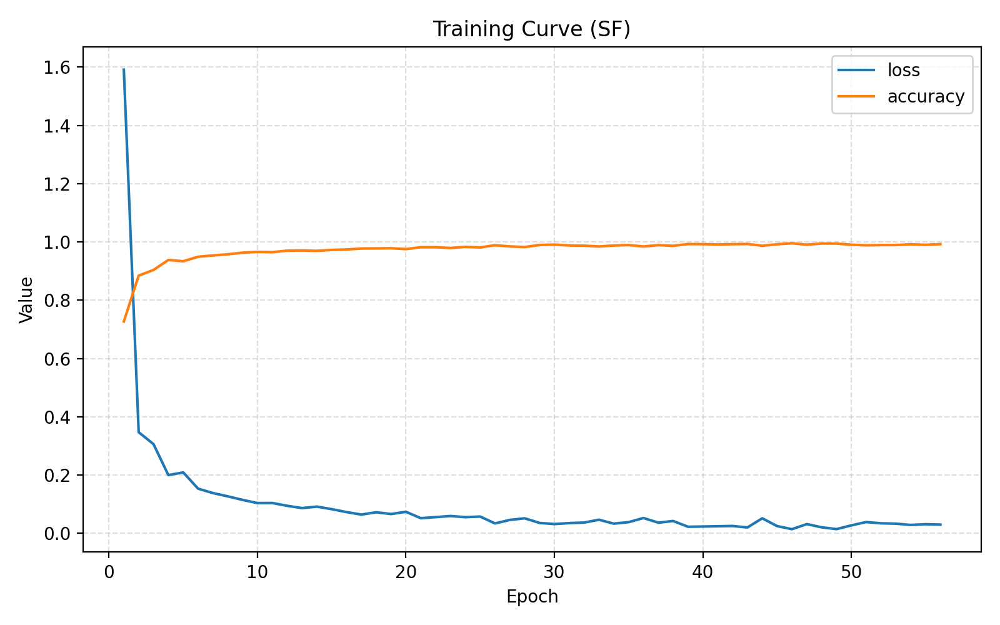

# 研究進捗報告 (2026/01/09)

## 1. Attention機構の改良について

本プロジェクトにおける `CV-MsAtViT` モデルの核心的改良として、**真の複素数Attention (True Complex-Valued Attention)** を実装・導入しました。

### 背景と課題
従来のモデルでは、Attention層に入力する直前で複素数データを実部と虚部に分離し、独立した2つの実数Attention層に入力していました（Split-Attention）。
$$
\text{Attention}(z) \approx \text{Attention}(Re(z)) + j \cdot \text{Attention}(Im(z))
$$
この方法では、実部と虚部の間の相関（クロス項）が計算過程で無視されるため、PolSARデータにとって最も重要な**「偏波間の位相差情報」がAttentionスコアに反映されない**という理論的な欠陥がありました。

### 変更内容：完全複素数処理への移行
この問題を解決するため、入出力および内部計算をすべて複素数のまま行う `ComplexMultiHeadAttention` 層を新規に開発・適用しました。

具体的な変更点は以下の通りです：

1.  **複素プロジェクション (Complex Projection)**:
    Query, Key, Value の生成に加え、最終出力の射影においても、`cvnn` ライブラリの `ComplexDense` 層を使用し、複素行列演算を行っています。
    $$ Q, K, V \in \mathbb{C} $$

2.  **複素内積によるスコア計算 (Conjugate Product)**:
    Attentionスコアの計算において、単なる転置ではなく**共役転置 (Conjugate Transpose, $\dagger$)** を用いています。
    $$ \text{Score} = \text{Re}(Q K^\dagger) $$
    これにより、信号の振幅の相関だけでなく、位相の整合性もスコアに寄与するようになります。

3.  **位相情報の保存 (Phase Preservation)**:
    Softmaxによって得られる重み（確率）は実数ですが、それを掛け合わせる対象である Value ($V$) は複素数のままであるため、出力 $O$ には位相情報が保存されたまま伝播します。
    $$ O = \text{Softmax}(\dots) \cdot V $$

これにより、モデルは偏波情報の「振幅」と「位相」の両方を統合的に学習できるようになりました。

---

## 2. 実験結果

San Francisco (SF) データセットにおけるattention変更後の学習・推論結果は以下の通りです。

### 学習曲線

### 精度評価指標

| 指標 | 結果 |
| :--- | :--- |
| **OA (Overall Accuracy)** | **97.71 %** |
| **AA (Average Accuracy)** | **90.64 %** |
| **Kappa Coefficient** | **96.42 %** |

attention変更前は以下の通りです

### 精度評価指標

| 指標 | 結果 |
| :--- | :--- |
| **OA (Overall Accuracy)** | **97.86 %** |
| **AA (Average Accuracy)** | **94.53 %** |