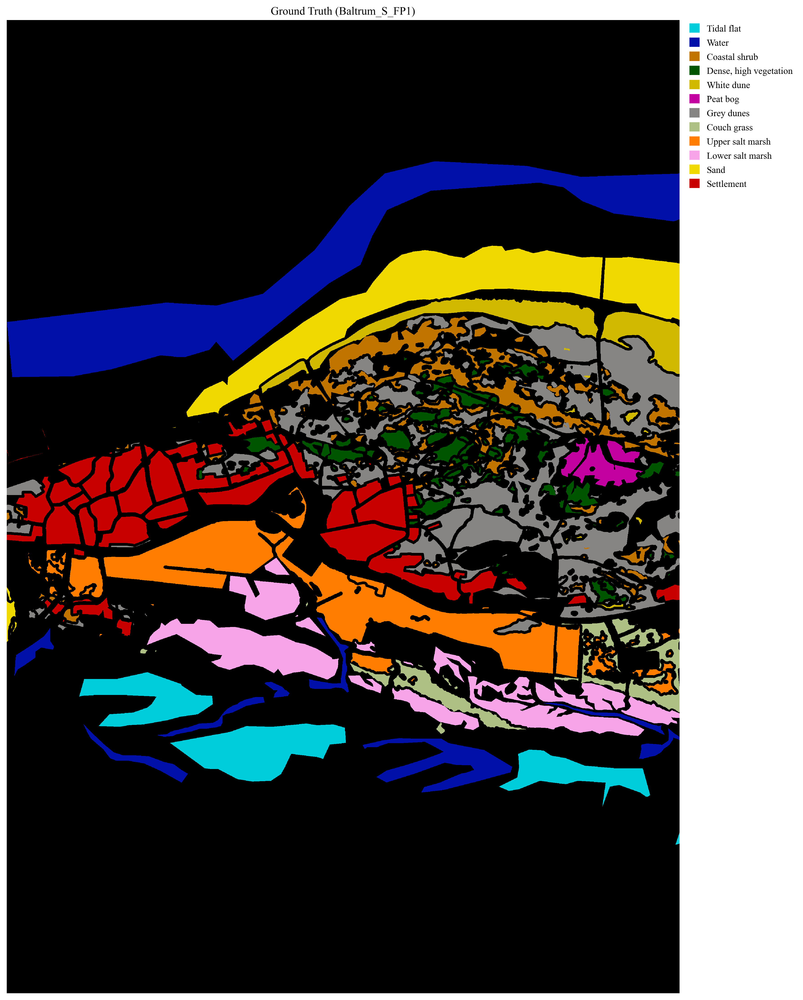
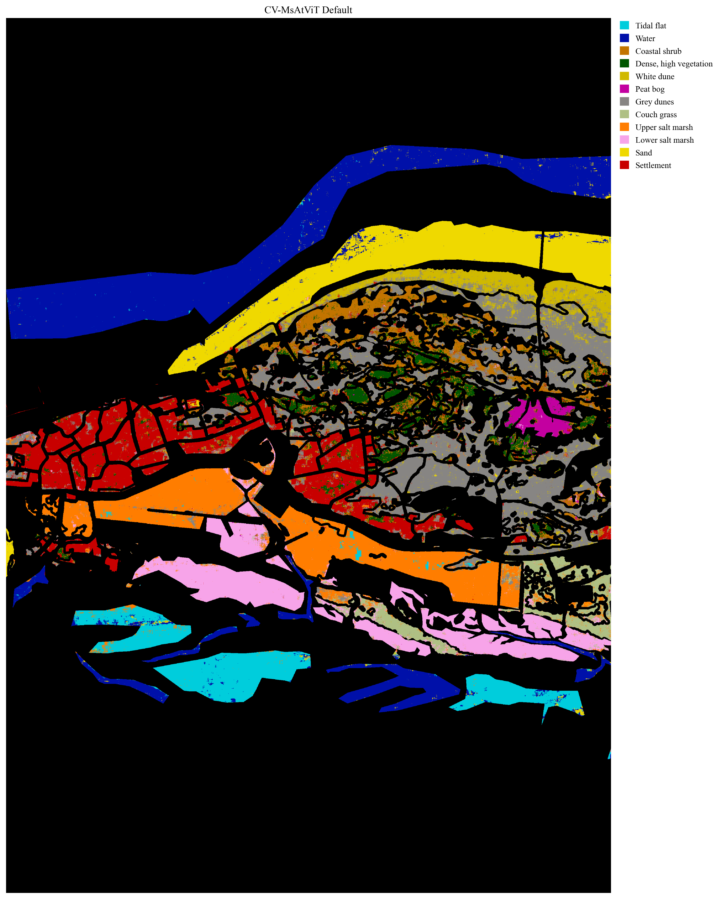
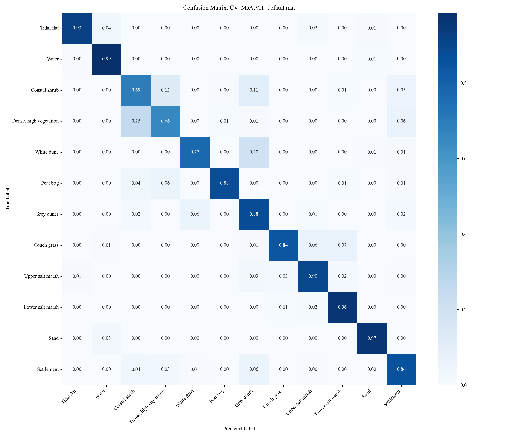

# 研究進捗報告 (2026/02/02)
#### 澁谷優人
## データセット
Baltrum_S_FP1 
GT付きのピクセル数が2457178
trainに用いたのがその1%
testに用いたのが残り99%
random_seed=42

### 学習結果比較 (デフォルト vs 提案手法)

#### 全体指標 (Overall Metrics)
| Metric | Default | Proposed |
| :--- | :---: | :---: |
| **OA (Overall Accuracy)** | **90.09%** | 88.29% |
| **AA (Average Accuracy)** | **86.40%** | 84.40% |
| **Kappa** | **0.89** | 0.85 |

#### クラス別精度 (Class-wise Metrics)
**注:** 数値は `(Precision / Recall / F1-score)` の順で記載

| Class ID | Class Name | Default | Proposed |
| :---: | :--- | :--- | :--- |
| **0** | Tidal flat | 96.78 / 92.67 / 94.68 | 96.95 / 81.03 / 88.28 |
| **1** | Water | 96.92 / 98.62 / 97.76 | 93.41 / 98.13 / 95.71 |
| **2** | Coastal shrub | 69.63 / 69.08 / 69.35 | 69.78 / 50.00 / 58.26 |
| **3** | Dense, high vegetation | 62.58 / 65.36 / 63.94 | 46.23 / 84.34 / 59.73 |
| **4** | White dune | 74.29 / 76.85 / 75.55 | 90.93 / 52.62 / 66.66 |
| **5** | Peat bog | 93.25 / 87.49 / 90.28 | 86.29 / 87.34 / 86.81 |
| **6** | Grey dunes | 84.09 / 87.76 / 85.89 | 80.05 / 91.34 / 85.32 |
| **7** | Couch grass | 82.09 / 83.94 / 83.00 | 76.58 / 84.30 / 80.26 |
| **8** | Upper salt marsh | 93.78 / 89.80 / 91.75 | 91.77 / 89.62 / 90.68 |
| **9** | Lower salt marsh | 93.55 / 96.45 / 94.98 | 94.07 / 94.87 / 94.47 |
| **10** | Sand | 96.76 / 96.64 / 96.70 | 95.27 / 94.37 / 94.82 |
| **11** | Settlement | 91.56 / 86.15 / 88.77 | 90.40 / 81.65 / 85.81 |

#### 平均 (Averages)
| Type | Default | Proposed |
| :--- | :--- | :--- |
| **Macro Avg** | 86.27 / 85.90 / 86.05 | 84.31 / 82.47 / 82.23 |
| **Weighted Avg** | 90.00 / 89.89 / 89.91 | 88.22 / 87.18 / 87.10 |

### 学習結果 写真
GT

先行研究

提案手法

### 混同行列
先行研究

提案手法

