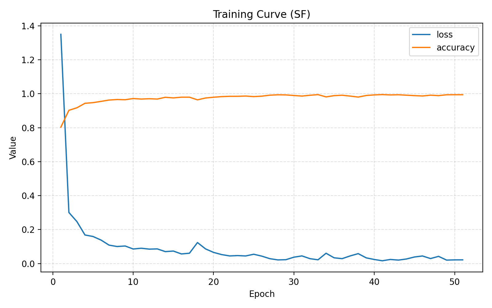

# 研究進捗報告 (2026/01/15) 
澁谷 優人

### 変更
間違って、softmax関数がabsを取って計算するような実装になっていた。これを実部のみを用いて計算するように変更した。

### 精度評価指標

| 指標 | 結果 |
| :--- | :--- |
| **OA (Overall Accuracy)** | **97.68 %** |
| **AA (Average Accuracy)** | **91.84 %** |

### 学習曲線

### 聞きたいこと

- 複素数に対してのReLUを実装するとき、以下の2つが考えられるが、どちらの方が良いか
    - $\mathrm{modReLU}(z)=\mathrm{ReLU}(|z|+b)\,\frac{z}{|z|+\epsilon}\ (z\neq 0),\ \mathrm{modReLU}(0)=0$
    - $f(z)=\tanh(|z|)\,\frac{z}{|z|+\epsilon}\ (z\neq 0),\ f(0)=0$

- Gunjanさんが使用した活性化関数の $\log\left(|z|+1\right)e^{i\,\arg(z)}$ はどこで用いれば良いのか?なぜこの形なのか? 
    - CVNNではReLUをした方がいいのかなと思っている
    - MLPで用いられているCart_GELUの代わりに使うべきか
- cart_GELUをどう複素数に置き換えれば良いか
- cart_sigmoidも振幅に対してsigmoidをかける形で良いか