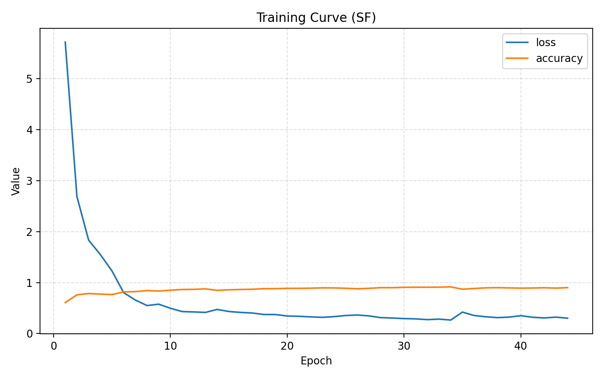
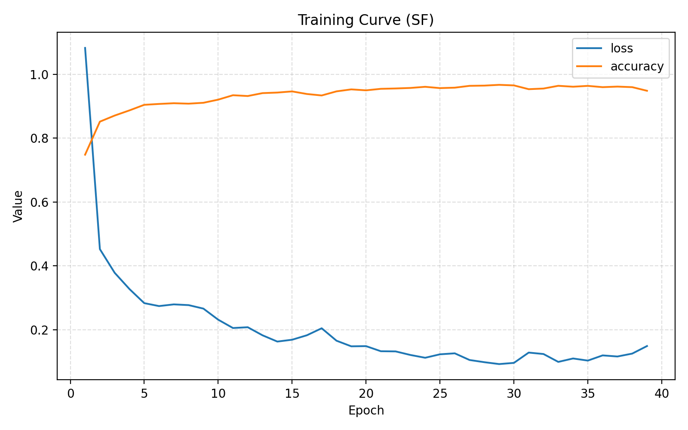

# 研究進捗報告 (2026/01/20)

### 実装変更点

#### 1. 振幅正規化 (Amplitude Layer Normalization) の実装
従来の実部・虚部を独立に正規化する手法 (`Split LayerNorm`) では、正規化によって位相情報（偏角）が歪んでしまうという課題がありました。
そこで、**振幅（信号強度）のみを正規化し、位相情報を完全に保持する** 新しい正規化レイヤー `AmplitudeLayersNormalization` を実装・導入しました。

**数式**:
入力 $z = |z|e^{j\phi}$ に対して、
$$
$$
z' = \text{LayerNorm}(|z|) \cdot e^{j\phi}
$$
ここで、$\text{LayerNorm}$ は振幅 $|z|$ の分布を平均0・分散1に正規化します。

#### 2. ModReLU 活性化関数の導入
Convolution層の活性化関数として、位相を保存しつつ振幅のみに非線形性を与える `ModReLU` (Modified ReLU) を実装しました。
$$ \text{ModReLU}(z) = \text{ReLU}(|z| + b) \cdot \frac{z}{|z| + \epsilon} $$
$b$ は学習可能なパラメータです。位相情報は変更されず、振幅のみが操作されます。
コマンドライン引数 `--activation-type` (デフォルト: `modrelu`) で従来の `Cartesian ReLU` と切り替え可能です。
※ `--activation-type modrelu` を選択した場合、MLP層の活性化関数も従来の `GELU` から `ModReLU` に置き換わります。 `--activation-type cart_relu` を選択した場合は、Conv層は `cart_relu`、MLP層は `cart_gelu` が使用されます。

### 実験結果比較 (SFデータセット)

Conv層の活性化関数は `ModReLU` で固定し、MLP層の活性化関数を変更した場合の比較結果です。

| 条件 (Conv / MLP) | OA | AA | Kappa |
| :--- | :--- | :--- | :--- |
| **Full ModReLU** (Conv=ModReLU, MLP=ModReLU) | 93.21% | 76.41% | 89.36% |
| **Hybrid** (Conv=ModReLU, MLP=GELU) | **96.15%** | **88.57%** | **93.95%** |

MLP層においては、振幅のみに着目する `ModReLU` よりも、従来の実数部・虚数部を扱う `GELU` (Cartesian GELU) の方が高い精度を示しました。これはMLP層が高い抽象度の特徴を扱う際、Cartesian座標系での非線形性が有効である可能性を示唆しています。

#### 学習曲線 (Training Curve)

**1. Full ModReLU (Conv=ModReLU, MLP=ModReLU)**

**2. Hybrid (Conv=ModReLU, MLP=GELU)**

### コード変更箇所詳細

| ファイル名 | 変更内容 | 変更箇所 (概算) |
| :--- | :--- | :--- |
| **`SAR_utils.py`** | `AmplitudeLayerNormalization`, `ModReLU` クラスの追加 `save_classification_map` 関数の追加 | 末尾に追加 |
| **`model_factory.py`** | `AmplitudeLayerNormalization`, `ModReLU` のインポート Conv層の活性化関数を `activation` 引数から分離し `ModReLU` レイヤーに変更 `build_msatvit` の引数に `layer_norm_type`, `activation_type` 追加 | 全体的に修正 |
| **`main_CV_MsAtViT.py`** | `--layer-norm-type`, `--activation-type` 引数の追加 デフォルトデータセットの `SF` への変更 `save_classification_map` の呼び出し追加 | `parse_args` および `main` 関数内修正 |
| **`net_flops.py`** | `None` シェイプに対する例外処理の追加 | L46付近 |
