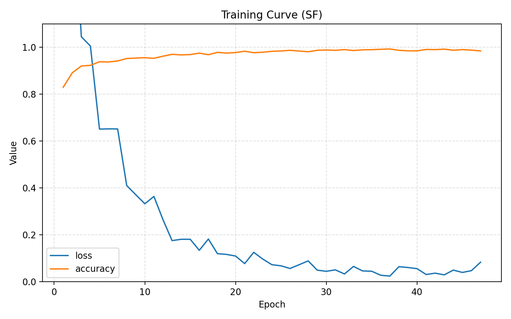

# 研究進捗報告 (2026/01/26)

### 1. 新たな正規化手法の提案: Complex Layer Normalization

これまでの実験結果（振幅のみの正規化の失敗、Split LayerNormの成功）を踏まえ、**「複素数そのものを、その統計的性質に基づいて正規化する」** 新たな手法を導入します。

#### 手法の概要
振幅や実部・虚部を個別に扱うのではなく、複素数をベクトルとして捉え、その「重心（平均）」と「広がり（全分散）」を用いて正規化を行います。

#### 数式定義

入力データ $z = x + jy$ に対して、以下の手順で正規化を行います。

**1. 複素平均 (Complex Mean) の算出**
複素平面上の重心を計算します。
$$ \mu = E[z] = E[x] + j E[y] $$
※ 特徴量軸（チャンネル方向）に対する平均を計算します。

**2. 全分散 (Total Variance) の算出**
重心からの「広がりの大きさ（分散）」を計算します。実部の分散と虚部の分散の和（共分散行列のトレースに相当）を使用します。
$$ \sigma^2 = E[|z - \mu|^2] = \text{Var}(x) + \text{Var}(y) $$

**3. 正規化 (Normalization)**
複素数 $z$ から平均 $\mu$ を引いてゼロ中心化し、全分散 $\sigma$ でスケーリングします。
$$ \hat{z} = \frac{z - \mu}{\sqrt{\sigma^2 + \epsilon}} $$

**4. アフィン変換 (Affine Transformation) (オプション)**
学習可能なパラメータを用いて、分布を再調整します。
$$ z_{out} = \gamma \cdot \hat{z} + \beta $$
*   $\gamma$ (Scale): 実数パラメータ (初期値 1.0)。分布の広がりを調整。
*   $\beta$ (Shift): 複素数パラメータ (初期値 0.0)。中心位置を調整。

#### 期待される効果
*   **ゼロ中心化の保証**: 複素平面上で重心が原点に揃うため、Deep Learningの学習安定性が確保されます。
*   **位相関係の保持**: スカラー倍でのスケーリングとなるため、各点どうしの相対的な位相関係や形状（アスペクト比）は維持されます（Split LayerNormのように円形に歪められることがありません）。

---
実装においては、現在の `AmplitudeLayerNormalization` クラスをこのロジックに置き換える形で修正を行います。

### 2. 実験結果

| 指標 | 結果 |
| :--- | :--- |
| **OA (Overall Accuracy)** | **97.51 %** |
| **AA (Average Accuracy)** | **89.30 %** |
| **Kappa** | **96.07 %** |

### 3. 学習曲線

