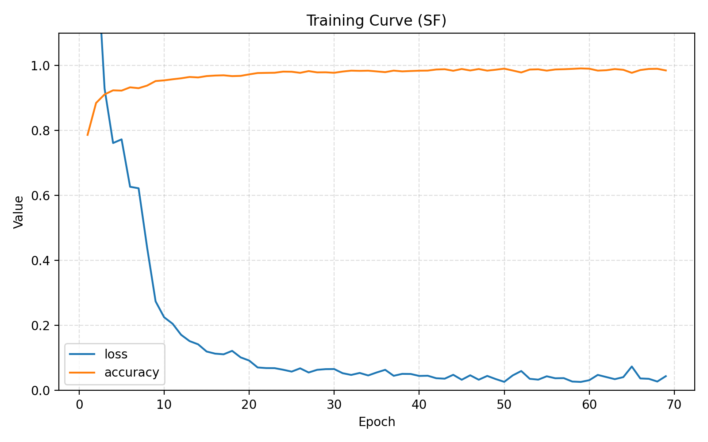
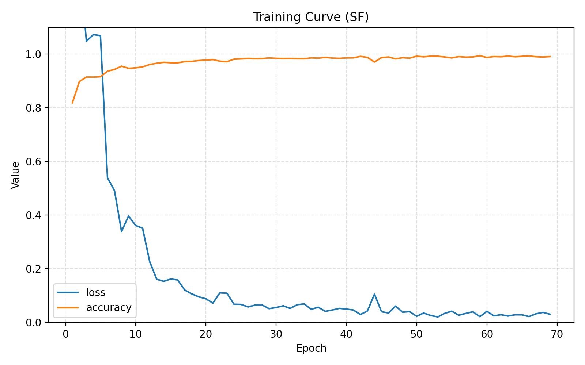

# 研究進捗報告 (2026/01/28)
#### 澁谷優人

### 1. Coordinate Attention の活性化関数の改良

#### 課題
これまで `CoordAttention.py` の Attention Map 生成部分において、活性化関数として `cart_sigmoid` が使用されていました。
$$ \text{cart\_sigmoid}(z) = \sigma(\text{Re}(z)) + j \cdot \sigma(\text{Im}(z)) $$
この関数は実部と虚部に独立してシグモイドを適用するため、**複素数の位相（偏角）を非線形に歪めてしまう** という問題がありました。Attention Map は「信号の重要度」を表すスカラー（に近い振る舞い）であるべきですが、`cart_sigmoid` は位相回転も引き起こしてしまいます。

#### 変更内容: ModSigmoid の導入
位相情報を保存しつつ、振幅（重要度）のみを $0 \sim 1$ の範囲に正規化するために、新たな活性化関数 **`ModSigmoid`** を実装し、Coordinate Attention に適用しました。

**数式**:
$$ \text{ModSigmoid}(z) = \sigma(|z| + b) \cdot \frac{z}{|z| + \epsilon} $$
ここで $\sigma$ はシグモイド関数、$b$ は学習可能なバイアスパラメータです。


#### ModTanhScaled の導入
`ModSigmoid` の比較対象として、`tanh` 関数を用いた振幅ゲーティング **`ModTanhScaled`** も実装・検証しました。

**数式**:
$$ \text{ModTanhScaled}(z) = \frac{1 + \tanh(|z| + b)}{2} \cdot \frac{z}{|z| + \epsilon} $$

### 2. コード変更箇所

*   **`SAR_utils.py`**: `ModSigmoid` クラスの定義を追加。
*   **`CoordAttention.py`**: `activation="cart_sigmoid"` を削除し、`ModSigmoid` レイヤーに置き換え。

```python
# 変更前
a_h = ComplexConv2D(..., activation="cart_sigmoid")(x_h)

# 変更後
a_h = ComplexConv2D(..., activation=None)(x_h)
a_h = ModSigmoid()(a_h)
```

### 学習結果


| 指標 | Prior (cart_sigmoid) | ModSigmoid | ModTanhScaled |
| :--- | :--- | :--- | :--- |
| **OA (Overall Accuracy)** | **97.81 %** | **96.91 %** | **95.94 %** |
| **AA (Average Accuracy)** | **89.35 %** | **90.14 %** | **85.77 %** |
| **Kappa** | **96.55 %** | **95.17 %** | **93.54 %** |


--- Class-wise Accuracy ---

| クラス名 | Prior (cart_sigmoid) | ModSigmoid | ModTanhScaled |
| :--- | :--- | :--- | :--- |
| Class 0 | **63.16 %** | **70.61 %** | **77.51 %** |
| Class 1 | **96.49 %** | **90.89 %** | **90.90 %** |
| Class 2 | **99.82 %** | **98.75 %** | **99.30 %** |
| Class 3 | **98.99 %** | **97.99 %** | **99.77 %** |
| Class 4 | **88.28 %** | **92.46 %** | **61.38 %** |


それぞれのクラスの個数

Class #0: 13564 (Bare Soil / 土壌)
Class #1: 62104 (Mountain / 山岳)
Class #2: 326270 (Water / 水域)
Class #3: 339367 (Urban / 都市)
Class #4: 52974 (Vegetation / 植生)

sigmoid




tanh


