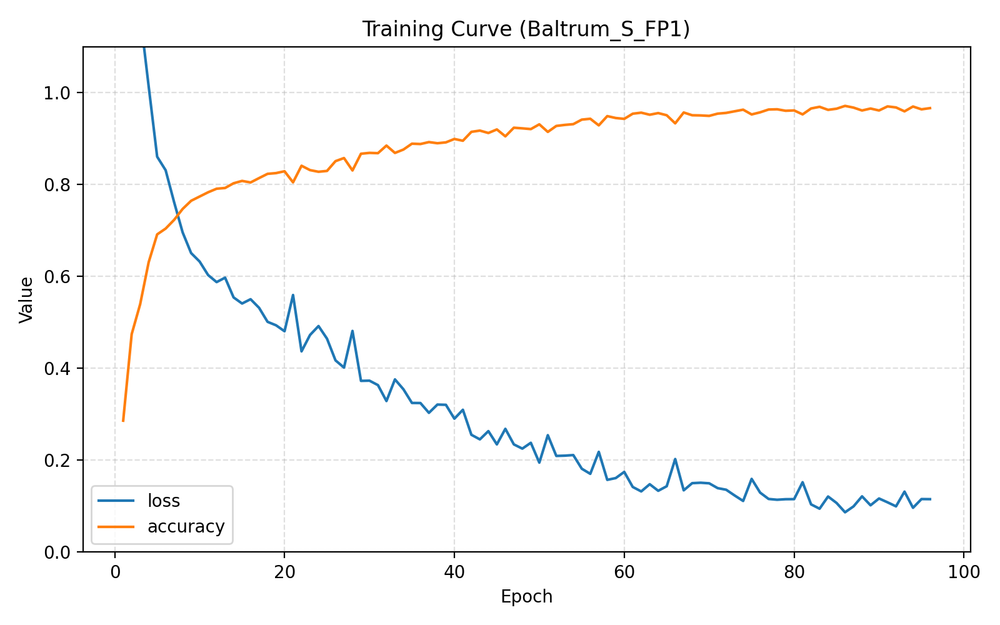
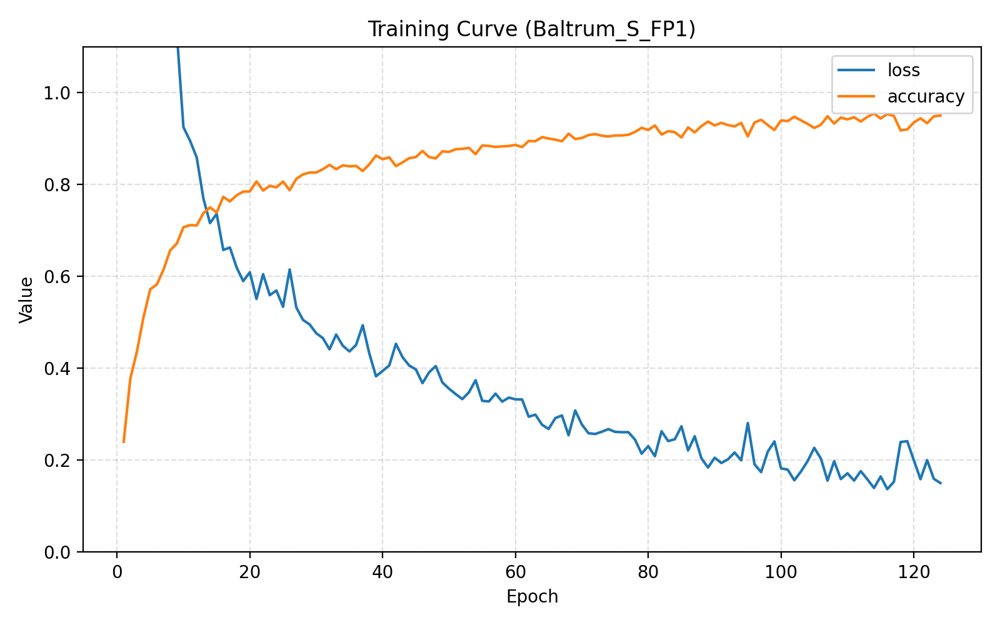

### 研究進捗報告 (2026/01/291)

#### 1. Baltrumでやってみた結果(学習曲線)

#### accuracy

提案手法

oa =  79.92
aa =  76.00
Kappa =  77.33
--- Class-wise Accuracy ---
Class 0: 90.71
Class 1: 83.81
Class 2: 63.72
Class 3: 43.54
Class 4: 67.38
Class 5: 74.48
Class 6: 79.48
Class 7: 76.34
Class 8: 85.98
Class 9: 95.58
Class 10: 77.01
Class 11: 73.94

先行研究

oa =  87.49
aa =  81.75
Kappa =  85.78

| 指標 | 先行研究 | ModSigmoid | Tanh |
| :--- | :--- | :--- | :--- |
| **OA (Overall Accuracy)** | **97.81 %** | **96.91 %** | **95.94 %** |
| **AA (Average Accuracy)** | **89.35 %** | **90.14 %** | **85.77 %** |
| **Kappa** | **96.55 %** | **95.17 %** | **93.54 %** |

#### 学習曲線

--- Class-wise Accuracy ---

| クラス名 | 先行研究 | Sigmoid |　Tanh |
| :--- | :--- | :--- | :--- |
| Class 0 | **63.16 %** | **70.61 %** | **77.51 %** |
| Class 1 | **96.49 %** | **90.89 %** | **90.90 %** |
| Class 2 | **99.82 %** | **98.75 %** | **99.30 %** |
| Class 3 | **98.99 %** | **97.99 %** | **99.77 %** |
| Class 4 | **88.28 %** | **92.46 %** | **61.38 %** |

それぞれのクラスの個数

Class #0: 
Class #1: 
Class #2: 
Class #3: 
Class #4:  -->

先行研究

提案手法

